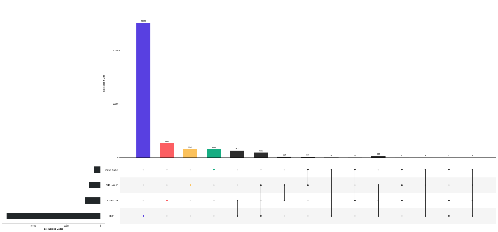

<!---->

# GRIP-seq

Here is the repositories of our unpublished paper, which introduciong a new technique **GRIP-seq**.

You can use the pipeline described below to analysis GRIP-seq data.

## Install

1. Clone the package
```
git clone https://github.com/Shall-We-Dance/GRIP-seq.git
cd GRIP-seq
```

2. Create conda environment using `GRIP-seq.yml`.
```
# create conda environment for GRIP-seq
conda env create -f GRIP-seq.yml

# activate conda evironment - GRIP-seq
conda activate GRIP-seq
```

3. Install [clipper](https://github.com/YeoLab/clipper).
```
# to test
conda activate clipper3
clipper -h
```

## Pipeline

### 1.  Make directories.

+ Make a directory `ANALYSIS_DIR` for this analysis, put your raw data at `ANALYSIS_DIR/raw_data` folder. 

+ Make a directory `GENOME_DIR` for [STAR](https://github.com/alexdobin/STAR) to generate genome index. 

+ Make a directory `TOOLS_DIR`, and install these 4 tools: [STAR](https://github.com/alexdobin/STAR), [meme](https://meme-suite.org/meme/doc/download.html), [clipper](https://github.com/YeoLab/clipper), [metaPlotR](https://github.com/olarerin/metaPlotR) . 

  The directory structure should be like:
  
```
${TOOLS_DIR}/
    meme/
        #Using meme to find motif
    STAR/
        #Using STAR to map reads
    clipper/
        #Using clipper to call peaks
    metaPlotR/
        #Using clipper to create metagene plots
${ANALYSIS_DIR}/
    raw_data/
        # Your reads files
${GENOME_DIR}/

```

### 2.  Generate genome indexes for [STAR](https://github.com/alexdobin/STAR)

  ```
  #basic usage
  cd scripts
  bash generate_genome_index.sh ${GENOME_DIR}
  ```
  This will generate a hg19 genome index using defalut settings, which uses `--sjdbOverhang=100` and runs on 8 threads.
  
  To specify the threads used to generate, run:
  
  ```
  #specify CPU threads
  bash generate_genome_index.sh ${GENOME_DIR} ${CPU_THREADS}
  ```
  
  The ideal value of `--sjdbOverhang` is `max(ReadLength)-1`, to specify, run:
  
  ```
  #specify CPU threads & index length
  bash generate_genome_index.sh ${GENOME_DIR} ${CPU_THREADS} ${INDEX_LENGTH}
  ```
### 3.  Preprocess the raw data

  **Specify the name of your repeats in `scripts/repeats.txt`.**

  ```
  #basic usage
  conda activate GRIP-seq
  cd scripts
  bash preprocess.sh ${ANALYSIS_DIR} ${GENOME_DIR}
  ```

  This script will process the fastq files by fastp and cutadapt. Then mapping reads to genome using STAR.
  
  We will use an ID call `current` by defalut, to specify, run:
  
  ```
  bash preprocess.sh ${ANALYSIS_DIR} ${GENOME_DIR} ${ID}
  ```
  
  This script will run on `8` threads (CPU) by defalut, to specify, run:

  ```
  bash preprocess.sh ${ANALYSIS_DIR} ${GENOME_DIR} ${ID} ${THREAD}
  ```
  
### 4.  Clipper

  ```
  #basic usage
  conda activate clipper3
  cd scripts
  bash clipper.sh ${ANALYSIS_DIR} 
  ```
  
  This script will use the mapping result (STAR) to call peaks by clipper.
  
  **⚠️NOTE: This is not the final peak results. **
  
  We will use an ID call `current` by defalut, to specify, run:
  
  ```
  bash clipper.sh ${ANALYSIS_DIR} ${ID}
  ```
  
  This script will run on `8` threads (CPU) by defalut, to specify, run:

  ```
  bash clipper.sh ${ANALYSIS_DIR} ${ID} ${THREAD}
  ```
  
### 5.  Call peaks

  ```
  #basic usage
  conda activate GRIP-seq
  cd scripts
  bash GRIP_peak.sh ${ANALYSIS_DIR} 
  ```
  
  This script will use the mapping result (STAR) to call peaks by clipper.
  
  
  We will use an ID call `current` by defalut, to specify, run:
  
  ```
  bash GRIP_peak.sh ${ANALYSIS_DIR} ${ID}
  ```
  
  This script will run on `8` threads (CPU) by defalut, to specify, run:

  ```
  bash GRIP_peak.sh ${ANALYSIS_DIR} ${ID} ${THREAD}
  ```
  
