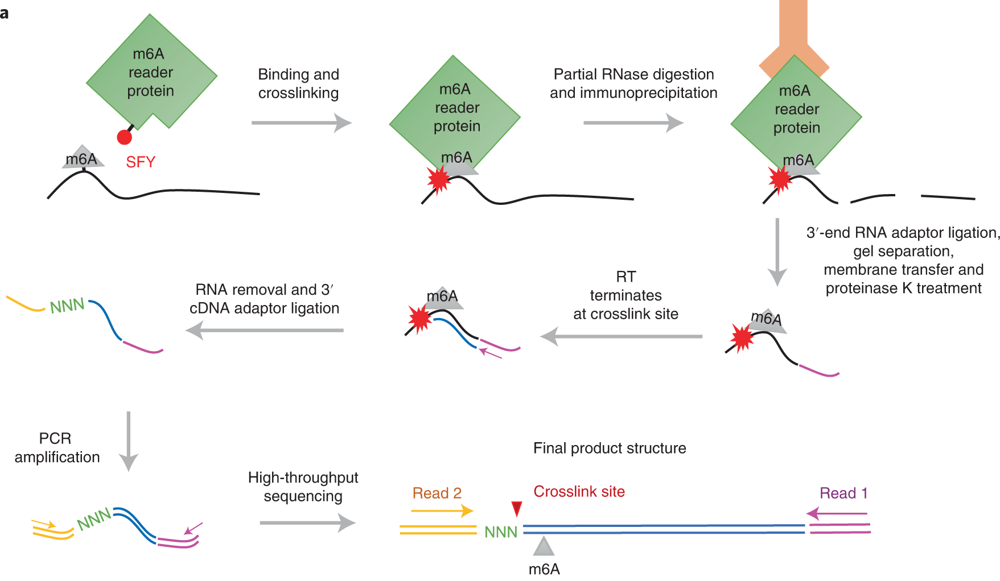

# GRIP-seq



Welcome to our research article published in [***Nature Chemistry***](https://doi.org/10.1038/s41557-022-01038-4), where we introduced an innovative technique called **GRIP-seq** (**G**ECX-**R**NA with **i**mmuno**p**recipitation). This method paves the way for in vivo identification of unknown **N<sup>6</sup>-methyladenosine on RNA** with **single-nucleotide resolution** throughout the transcriptome using **unnatural amino acids** (UAAs).

To facilitate the analysis of GRIP-seq data, we have outlined a comprehensive pipeline below. By following these steps, you can gain valuable insights from GRIP-seq experiments.

Additionally, for those interested in exploring further, our raw sequencing data is accessible on NCBI's Sequence Read Archive (SRA): [PRJNA797913](https://www.ncbi.nlm.nih.gov/bioproject/PRJNA797913).

## Install

1. Clone the repository.
```sh
git clone https://github.com/Shall-We-Dance/GRIP-seq.git
cd GRIP-seq
```

2. Create a new conda environment using `GRIP-seq.yml`.
```sh
# create a new conda environment for GRIP-seq
conda env create -f GRIP-seq.yml

# activate the conda evironment - GRIP-seq
conda activate GRIP-seq
```

3. Install [clipper](https://github.com/YeoLab/clipper).
```sh
# create a conda environment for clipper3
conda env create -f clipper3.yml

# for test
conda activate clipper3
clipper -h
```

## Pipeline

### 1.  Create directories.

+ Create a directory named `ANALYSIS_DIR` for this analysis, and place your raw data in the `ANALYSIS_DIR/raw_data` folder. 

+ Create a directory named `GENOME_DIR` for [STAR](https://github.com/alexdobin/STAR) to generate the genome index. 

+ Create a directory named `TOOLS_DIR`, and install the following four tools: [STAR](https://github.com/alexdobin/STAR), [meme](https://meme-suite.org/meme/doc/download.html), [clipper](https://github.com/YeoLab/clipper), [metaPlotR](https://github.com/olarerin/metaPlotR) . (Note: STAR and meme could also be installed using conda)

  Please ensure the directory structure follows the format:
  
```sh
${TOOLS_DIR}/
    meme/
        #Using meme to find motif
    STAR/
        #Using STAR to map reads
    clipper/
        #Using clipper to call peaks
    metaPlotR/
        #Using clipper to create metagene plots
${ANALYSIS_DIR}/
    raw_data/
        # Your reads files
${GENOME_DIR}/

```

### 2.  Generate the genome indexes for [STAR](https://github.com/alexdobin/STAR)

  ```sh
  #basic usage
  cd scripts
  bash generate_genome_index.sh ${GENOME_DIR}
  ```
  This command will generate an hg19 genome index using default settings, including `--sjdbOverhang=100` and utilizing 8 threads for processing.
  
  To specify the number of threads used for generation, execute the following command:
  
  ```
  #specify CPU threads
  bash generate_genome_index.sh ${GENOME_DIR} ${CPU_THREADS}
  ```
  
  The ideal value of `--sjdbOverhang` is `max(ReadLength)-1`, to specify, run:
  
  ```
  #specify CPU threads & index length
  bash generate_genome_index.sh ${GENOME_DIR} ${CPU_THREADS} ${INDEX_LENGTH}
  ```
### 3.  Preprocess the raw data

  **Please specify the name of your repeats in `scripts/repeats.txt`.**

  ```sh
  #basic usage
  conda activate GRIP-seq
  cd scripts
  bash preprocess.sh ${ANALYSIS_DIR} ${GENOME_DIR}
  ```

  This script processes the FASTQ files using fastp and then maps the reads to the genome using STAR.
  
  We will use an ID called `current` by defalut, to specify, run:
  
  ```sh
  bash preprocess.sh ${ANALYSIS_DIR} ${GENOME_DIR} ${ID}
  ```
  
  This script will run on `8` threads (CPU) by defalut, to specify, run:

  ```sh
  bash preprocess.sh ${ANALYSIS_DIR} ${GENOME_DIR} ${ID} ${THREAD}
  ```
  
### 4.  Clipper

  ```sh
  #basic usage
  conda activate clipper3
  cd scripts
  bash clipper.sh ${ANALYSIS_DIR} 
  ```
  
  This script utilizes the mapping results from STAR to call peaks using clipper.
  
  **⚠️NOTE: This is not the final peak results.**
  
  We will use an ID called `current` by defalut, to specify, run:
  
  ```sh
  bash clipper.sh ${ANALYSIS_DIR} ${ID}
  ```
  
  This script will run on `8` threads (CPU) by defalut, to specify, run:

  ```sh
  bash clipper.sh ${ANALYSIS_DIR} ${ID} ${THREAD}
  ```
  
### 5.  Call peaks

  ```sh
  #basic usage
  conda activate GRIP-seq
  cd scripts
  bash GRIP_peak.sh ${ANALYSIS_DIR} 
  ```
  
  This script utilizes the clipper results to call N<sup>6</sup>-methyladenosine sites.
  
  
  We will use an ID called `current` by defalut, to specify, run:
  
  ```sh
  bash GRIP_peak.sh ${ANALYSIS_DIR} ${ID}
  ```
  
  This script will run on `8` threads (CPU) by defalut, to specify, run:

  ```sh
  bash GRIP_peak.sh ${ANALYSIS_DIR} ${ID} ${THREAD}
  ```
  
## Citing this work

If you use our code or data, please cite:

```bibtex
@article{sun2022genetically,
  author = {Sun, Wei and Wang, Nanxi and Liu, Hongjiang and Yu, Bingchen and Jin, Ling and Ren, Xingjie and Shen, Yin and Wang, Lei},
  title = {Genetically encoded chemical crosslinking of RNA in vivo},
  journal = {Nature Chemistry},
  pages = {1--12},
  year = {2022},
  publisher = {Nature Publishing Group UK London},
  doi = {10.1038/s41557-022-01038-4}
}
```
